# Auto Backup & Restore Pi Node (Docker Compose)

Script ini digunakan untuk **backup data PostgreSQL dari Pi Node di server sumber** dan **restore ke server target** secara otomatis, termasuk setup Docker dan Pi-Node CLI jika belum ada. Cocok untuk migrasi node Pi Network.

---

## Fitur

- Backup container `mainnet` di server sumber
- Kirim data PostgreSQL ke server target via SCP
- Install Docker & Pi-Node CLI di server target jika belum ada
- Backup node lama di server target
- Initialize node baru di server target dengan `--force --auto-confirm`
- Restore data PostgreSQL ke server target
- Restart container dan cek status node
- Restart container di server sumber

---

## Prasyarat

- Server sumber dan target menggunakan Ubuntu 22.04 atau versi kompatibel
- Akses `root` atau user dengan sudo di server sumber & target
- Docker sudah terinstall (script otomatis install jika belum ada)
- Pi-Node CLI versi resmi (`pi-node`) akan diinstall otomatis jika belum ada

---

## Cara Menjalankan

1. Clone repository ini:

```bash
git clone https://github.com/zendshost/horizon-dump.git
cd horizon-dump
````

2. Beri permission agar script bisa dijalankan:

```bash
chmod +x run.sh
```

3. Jalankan script:

```bash
./run.sh
```

4. Masukkan **IP server target** saat diminta. Script akan:

   * Membuat backup PostgreSQL dari container `mainnet` di server sumber
   * Mengirim data ke server target
   * Install Docker & Pi-Node CLI di server target jika belum ada
   * Backup node lama di server target
   * Initialize node baru di server target dengan `--force --auto-confirm`
   * Restore data PostgreSQL
   * Restart container `mainnet` di server target
   * Menampilkan status node target
   * Restart container node di server sumber

---

## Alur Proses

```mermaid
flowchart TD
    A[Mulai: Jalankan run.sh di server sumber] --> B[Membuat backup PostgreSQL dari container mainnet]
    B --> C[Kirim data backup ke server target via SCP]
    C --> D{Apakah Docker & Pi-Node CLI terinstall di server target?}
    D -- Tidak --> E[Install Docker & Pi-Node CLI di server target]
    D -- Ya --> F[Lanjut]
    E --> F
    F --> G{Apakah node lama ada di server target?}
    G -- Ya --> H[Backup node lama di server target]
    G -- Tidak --> I[Lanjut]
    H --> I
    I --> J[Initialize Pi Node di server target dengan force dan auto-confirm]
    J --> K[Restore data PostgreSQL ke server target]
    K --> L[Restart container mainnet di server target]
    L --> M[Tampilkan status node target]
    M --> N[Restart node server sumber]
    N --> O[Selesai ✅]
```



---

## Catatan

* Jika Pi-Node CLI sudah ada, script tetap akan menggunakannya.
* Jika node lama di server target ada, akan dibackup otomatis.
* Pastikan port Docker Compose container `mainnet` tidak conflict di server target.
* Untuk memeriksa status node target setelah restore:

```bash
pi-node status
pi-node protocol-status
```

---

## Lisensi

Repository ini bersifat open source. Gunakan dengan risiko sendiri.
